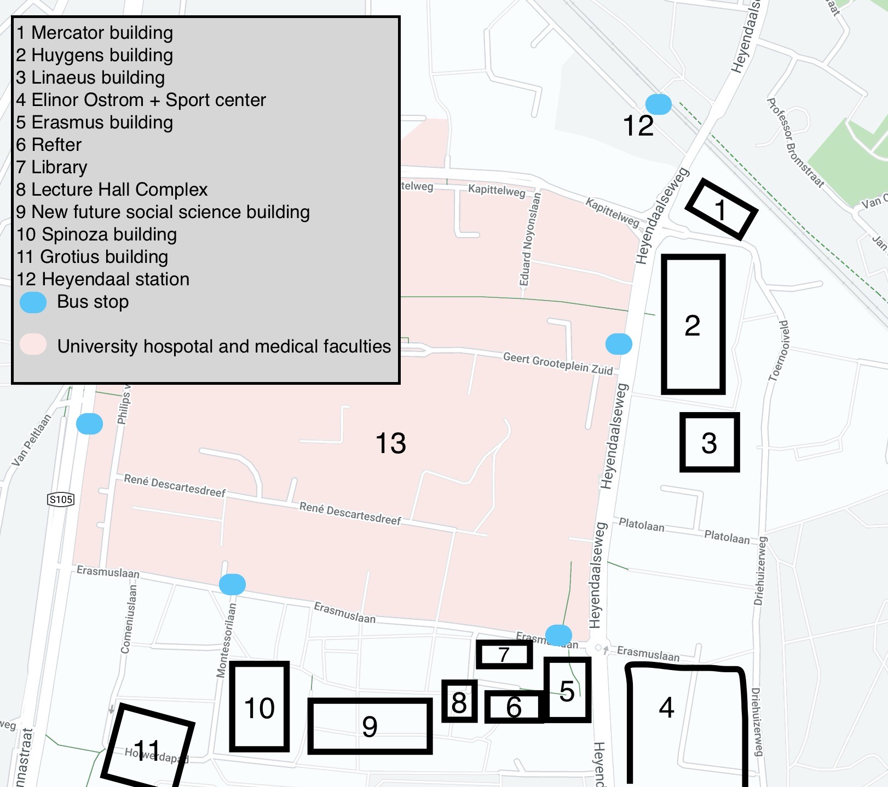

### Campus

##### Here I will give some info about the campus you might need

___

#### How to get there
From the Nijmegen train station you have a couple of options:
1. Bus 10 (Heyendaal shuttle) from [the bus stop next to the bicycle parking](https://www.google.com/maps/place/Nijmegen/@51.8413998,5.8521553,16.8z/data=!4m5!3m4!1s0x47c70867bbe749d1:0x59caa91a36f94b1e!8m2!3d51.842675!4d5.8534759) to the left when facing the station from the front. Note that the bus station with all other busses is to the right. Bus 10 will stop at 4 places on campus, Heyendaal station, Huygens building, Erasmus building and Spinoza building, and then loop back to the central station. This bus goes very often and is often quite busy (especially in the morning);
2. Arriva train headed to Roermond from platform 1b to Nijmegen Heyendaal. This is a small train station (almost) on the campus. See the campus map;
3. [By bike](https://www.google.com/maps/dir/Nijmegen,+6512+AB+Nijmegen/51.820402,5.8666339/@51.833144,5.8557188,17.21z/am=t/data=!4m9!4m8!1m5!1m1!1s0x47c708663249914d:0xf57c51a11acb43fc!2m2!1d5.8530307!2d51.8432285!1m0!3e1), Riding down the bike path south (towards the Mercure Hotel and ROC building next to the station) for a while until you get to the crossing with Sint Annastraat, cross the road and continue (almost) straight ahead on Pagodepad. Cross the Groenewoudseweg and continue straight again on Verlengde groenestraat. At the end of this bike path you will get to the Heyendaal train station, at the edge of campus.

___

#### Map

___

#### Buildings
You will visit many buildings on campus, but the most important ones I will list here, with their abbreviation used on the schedule in brackets. You can also find them on the campus map. 
* [Huygens Building](https://www.ru.nl/fnwi/faculteit/profiel/huygensgebouw/) (HG) - This is the main science faculty building (FNWI). It's the massive green building on the north side of campus. This building is the home for the science studies like physics, chemestry and biology but also has many big computer rooms on the ground floor. In these rooms you will often have work groups and lab sessions. The [Library of Science](https://www.ru.nl/fm/over-de-faculteit/contact/elinor-ostromgebouw/) is also located in this building
* [Spinoza Building](https://www.ru.nl/opleidingen/studeren-radboud/faciliteiten-campus/gebouwen/spinozagebouw/) (SP) - This is the main building for the social science faculty (which AI is a part of). It hosts studies like psychology, anthropology etc., and also AI. A new social science building, [the Maria Montessori building](https://www.ru.nl/nieuwbouwfsw/), is under construction which will likely take the place of the Spinoza buidling. This building has the (tiny) office for the AI study association [Cognac](https://svcognac.nl).
* [Erasmus building](https://www.ru.nl/propertymanagement/building-on-campus/erasmus-building-and-square/) (E) - The Erasmus building is the tallest structure in Nijmegen. It is located in the center of campus and is the home of many study programs like history, languages, etc. You may sometimes have a lecture here but rarely.
* [Linaeus building](https://www.ru.nl/uvb/campus/gebouwen/vm/linnaeusgebouw/) (LIN) - This building has three big lecture halls and like 5 smaller lecture rooms. It is next to the Huygens building. You will likely have lectures and many exams here.
* [Lecture Hall Complex](https://www.ru.nl/propertymanagement/campus/campus-buildings/vm/collegezalencomplex/) (CC) - the lecture hall complex has lecture halls... that's about it. It's pretty old and ugly but largely underground.
* [Mercator buildinig](https://www.ru.nl/bvcampus/mercator_i/over_mercator_i/) (MERC I) - This is the building for computer science. All CS student chill here and you can get free coffee (it's actually for CS students only so make some CS friends). You won't have much activity in this building, it has only one lecture room. It does have many offices for CS professors.

Under virtually every building there is bicycle parking space. 
___

#### Refter
[De Refter](https://www.ru.nl/fb/english/food_and_drink/de-refter/de-refter/) is the university restaurant. It is like a food court in a large mall. You can get burgers, pizza, oriental-style foods, and meals from a weekly menu you can check online. In this building there is a big printer service where you can print extraordinary stuff like posters, documents on thick paper, bound documents, etc. It is located on the Erasmus square, next to the Erasmus building.

___

#### Printing
You can [print on campus](https://www.ru.nl/fb/english/print/printing-campus/). There are printers in every building. You have to create an account on an app on which you can deposit money. This app is connected to your student number and student card and you can easily print things. Just follow the steps on the [tutorial](https://www.ru.nl/fb/english/print/printing-campus/).

___

#### Studying
You can study on campus in many buildings. There is a big [University Library](https://www.ru.nl/library/) where you can study. It's often busy though; I rarely went there. You you also study in the Library of Science, or in libraries of other faculties, such as in the [Elinor Ostrom building](https://www.ru.nl/fm/over-de-faculteit/contact/elinor-ostromgebouw/), the building for political studies, business studies etc., the [Grotius building](https://www.ru.nl/opleidingen/studeren-radboud/faciliteiten-campus/gebouwen/grotiusgebouw/) which houses the law studies (it's very beautiful). It's fun to explore other buildings. The Erasmus building also has a study area on the first floor. Or you can just study at home.

___

#### Computers
In all buldings you can work on desktops. You can login with your student number and password (same login as Brightspace). The most computers are in the Huygens building on the ground floor. In the science buildings you can login with your science login (which you can get at [CNCZ](https://wiki.cncz.science.ru.nl/Hoofdpagina), the computer & communications department on the first floor in the Huygens building). With your science login you can access more sciency applications and it's the default way to login in the Huygens building.

___

#### Sport facilities
There is a big [Sports Center](https://www.ru.nl/sportscentre/) on campus. You can get access for around €100/year. You can acces the gym and enroll in many many courses and classes. I believe you can also swim somewhere with this subscription. 

___

[Back to home](index.md)
