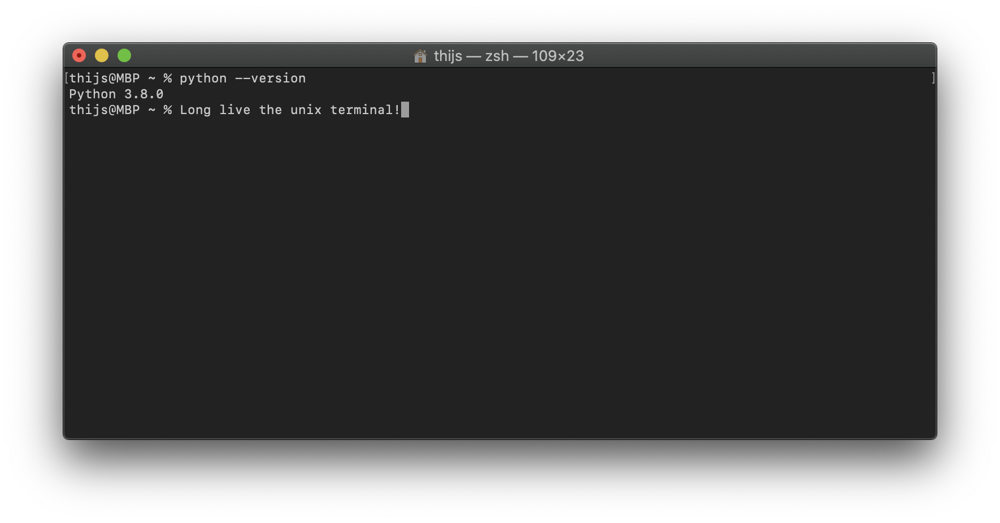

##### On this page I will describe some (software) tools that are useful during the AI bachelor and as a computer scientist in general.
___

* [Programming requirements](#programming-requirements)
* [IDEs](#ides)
* [Text editors](#text-editors)
* [Git](#git)
* [Github](#github)
* [Terminal](#terminal)
* [Writing papers](#writing-papers)
* [LaTeX](#latex)
* [Data storage](#data-storage)
* [Cognac website](#cognac-website)
* [LinkedIn](#linkedin)
* [Youtube](#youtube)

___

#### Programming requirements
To be able to write code, you need a few things...

* Firstly, logically, you need a computer (preferably your own laptop). It can be any laptop of any operating system; the programs you will write in your bachelor will not be so tough on your hardware, so any decent laptop will do. 
* Programming language (development kit).
  * Python: to write python code you need Python. many computers already have python installed. You can check this by opening a [terminal](#terminal) and typing `python --version`. If it shows a version (3.\*) you're good to go. Otherwise [download python here](https://www.python.org).
  * Java: to code java you need the java development kit. Here you can [download](https://www.oracle.com/java/technologies/javase-jdk13-downloads.html) the JDK version 13 (currently the latest)
* An [IDE](#ides).
* An interest and motivation for programming. Programming is much more than just learning the syntax of a language. It is a way of thinking. You will learn the mindset, and the tools you need to solve problems. If you program long enough, you will start to think of ways to solve problems in real-life by programming a solution, which is awesome.

#### IDEs
IDEs (Integrated Development Environment) are the programs in which you are going to write most of your code. Most IDEs you will use are specific to the programming language you will write in it. There exist IDEs in which you can write code in multiple languages, but I won't discuss those here, you will likely not use any.

- **For java:**
The first programming language you will write code in is java. There are many IDEs for java, and you will likely be taught to use the IDE your professor prefers (or has always used and is refusing to change). I will list some IDEs with links to their download page, and my opinion of them

* [Eclipse](https://www.eclipse.org) - probably your first recommended IDE by AI professors. It's okay. ([Eclipse tutorial playlist](https://www.youtube.com/playlist?list=PLEAQNNR8IlB5R_qZvrFH0g8wC_FLWK9si))
* [Netbeans](https://netbeans.apache.org) - probably the second recommended IDE by professors. It's bad, be warned for many troubles with this IDE. ([Netbeans tutorial](https://www.youtube.com/watch?v=K3twuFyPwkg), the quality of this video is representative of a Netbeans experience. It's an old video but Netbeans still looks exactly the same)
* [IntelliJ](https://www.jetbrains.com/idea/) - the absolute best IDE in my opinion; shockingly not recommended in any course I followed in the bachlor. IntelliJ is an IDE by the company [JetBrains](https://www.jetbrains.com). They create the best IDE for many programming languages. ([IntelliJ startup](https://www.youtube.com/watch?v=c0efB_CKOYo))

- **For python:**
You will also use the python programming language in your bachelor. For python, you have three good options to write code in.

* [PyCharm](https://www.jetbrains.com/pycharm/) is my recommended IDE for python programming. It is from the same company as IntelliJ (JetBrains) and works very similarly. You will want to use a proper IDE like this when writing larger programs or if you just like the help an IDE can offer during coding. ([Quick tutorial](https://www.youtube.com/watch?v=56bPIGf4us0))
* [Regular text editor](#other-text-editors). You can also write code in a regular text editor and run it in the command line ([terminal](#terminal)). Simply write your code, save it as name.py and run it in the terminal with `python name.py`. This is only recommended for small programs. For larger programs you should use a proper IDE.
* [Jupyter Notebook](https://jupyter.org/index.html). Jupyter notebooks are amazing to develop code which you want to run piece by piece. You can create _cells_ in which you write your code and you can run your cells one after the other. The python _interpreter_ will keep in memory all code that has been ran before so you can split your program over multiple blocks. This is useful for example when loading a lot of data or doing a computation that takes a long time, and doing various things with it after that. Instead of running the whole code again every time, you can just run the part where you work with the data and load it once at the start of your session. [Tutorial](https://www.youtube.com/watch?v=HW29067qVWk). (I recommend pip install instead of conda install if you don't already have the whole conda setup installed).

With your student-email (...@student.ru.nl) you can get the professional versions of JetBrains IDEs for free [here](https://www.jetbrains.com/student/). The free versions are fine too, but why not be fancy.

#### text editors
Often you may want to use a simple text editor. To open files to quickly see the contents without opening the complete IDE for example. Or when quickly writing some easy code. I recommend [Sublime Text](https://www.sublimetext.com). It's a great text editor and contains markup for virtually all coding languages. You will sometimes be prompted to buy a licence, but you can ignore that, it'll keep working.

#### Git
Sometimes you will be working on a large project and accidentally write a bug. Now you can't find the bug and it's messing everything up. All you want is to just go back to where everything worked again but you saved over all your files :(. The solution for this is a Version Control System, like Git. 

With git, you create a _repository_ in which you develop your program. Every time you feel like you wrote some changes to your code (or whatever is in your repository) you can _commit_ these changes, and git will create a snapshot of that current version of the repository. Git keeps track of all the commits you make in a repository and you can always go back to previous commits to take a look, or restore your project to a previous commit. You make your changes on a so called _branch_. If you want to try something new and you're not quite sure if it will work out, you can create a new branch and work on that branch, creating commits like normally. If you are satisfied with your change, you can _merge_ the branch on which you have been making changed with the _master branch_. This is a great way to work on programs without losing any previous saves. Check if you have git by typing `git --version` in your terminal, or [download git](https://git-scm.com/downloads).

Tutorials on git will be given in the next section on [GitHub](#github), a website that can host your repositories.

#### GitHub
[GitHub](https://github.com) is an amazing website on which you can store your project in git repositories. Repositories (repos) on Github are public or private, public repos can been seen by anyone, and private repos can only be seen by you and your collaborators. Collaborators? Yes! You can work together on a project in a repository, meaning you can all make changes and commit these to the repository. 

People make changes to the project and commit these changes locally and after they are done they can _push_ these changes to the repository host (github) this is as simple as writing `git push` in the terminal in the folder of your project. Other collaboraters can get these changes on their computer by writing `git pull`, pulling the changes from the repository host (Github) to their own computer!

You have to pull all changes so your project is up-to-date locally before you can push any changes. It may be possible that you and another team mate are working on the same file. In that case, Git is often smart enough to _merge_ the changes together. But in the case you both changed things in the same place, you will get a _merge conflic_ (you will get these for sure and get very annoyed with them). You can resolve these conflicts by opening the file in which there is a conflict and choosing one of the two versions (it will say where in the file). 

Getting familiar with git and used to all the syntax may take some effort, but it is definitely worth it. You will be using it all throughout your study, and likely later in your job too. 

Git commands are executed in the terminal, at the location of the git repository, but many [IDEs](#ides) and text editors offer built-in git support. In the IDE you can simply push a button to pull changes, make commits, and push them to the repository. JetBrain's IDEs have this option and it works really well.

GitHub also has a desktop client if you are deadly afraid of the [terminal](#terminal), but I recommend using the terminal commands because you will know for sure what is going on.

You will definitely need some tutorials to get the hang of the basics of a workflow with a version control system. here are some useful tutorial links.
* [Git & GitHub Crash Course For Beginners](https://www.youtube.com/watch?v=SWYqp7iY_Tc)
* [Github Tutorial For Beginners](https://www.youtube.com/watch?v=0fKg7e37bQE)
* [Learn Git In 15 Minutes](https://www.youtube.com/watch?v=USjZcfj8yxE)

Once again, you can get a [GitHub pro account for free](https://education.github.com/students) with your student email address (...@student.ru.nl). A pro GitHub account allows for unlimited private repositories, so you can store the projects you are working on for your courses on there without anyone seeing them and being able to copy from you.

You can also create websites and blogs easily with GitHub, like this website!!! It is built completely automatically and is super easy. [Learn more](https://pages.github.com)

#### Terminal

#### Writing papers
#### LaTeX

#### Data storage
#### Cognac website
#### LinkedIn
#### Youtube